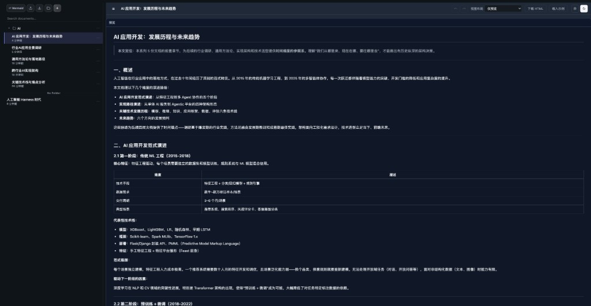
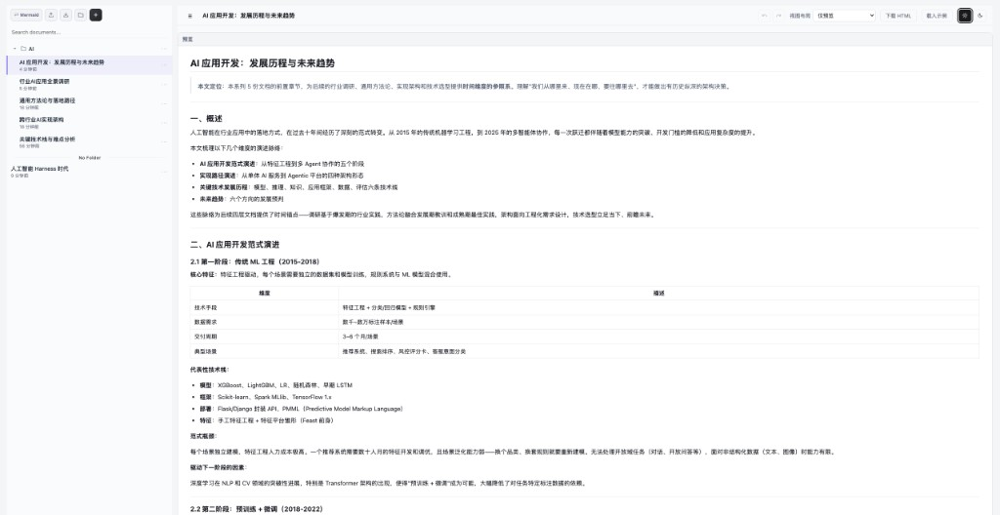

# MD Studio

基于 **Vue 3 + Vite** 的本地文档工作台：在浏览器中管理 Markdown 文档库、实时预览与导出，并提供独立的 **Mermaid** 编辑页。默认进入 **Markdown**（`/markdown`），侧栏可一键切到 **Mermaid**（`/mermaid`）。

## 界面预览

以下为 Markdown 编辑页在**深色**与**浅色**全站阅读主题下的界面（含文档库树、工具栏与预览区）。

| 深色模式 | 浅色模式 |
| :--: | :--: |
|  |  |

## 功能概览

### Markdown（`/markdown`）

- **文档库（IndexedDB）**
  - 树形展示：根目录与**文件夹**嵌套、文档可拖入文件夹或移回根目录
  - 文档：新建、切换、重命名、标题锁定/解锁、复制、删除、搜索、侧栏折叠与宽度拖拽
  - 文件夹：新建（**弹窗输入名称**）、重命名、删除、导出 ZIP、右键/⋯ 菜单
  - **导入**：工具栏上传（`.md` / `.txt` / `.zip`）；支持从文件夹菜单**上传到指定文件夹**；可选从 URL 拉取（需配置 `VITE_MD_FETCH_BASE`）
  - 导出当前文档为 `.md`（侧栏下载图标）
  - 老数据自动迁移（规格见设计文档）

- **编辑与预览**
  - 布局：**左右并列** / **仅 Markdown 源码** / **仅预览**
  - 源码：**Monaco**（Raw）或 **Toast UI WYSIWYG**；WYSIWYG 与预览区 Mermaid 块随**全站浅色/深色**切换主题
  - **编辑历史**：工具栏撤销 / 重做（停顿快照式，与 Monaco 逐字符撤销并存）
  - GFM 表格、任务列表；`DOMPurify` 消毒后的 HTML 预览
  - 文中 ` ```mermaid ` 分块渲染（企业风主题等）；预览内可展开编辑 Mermaid 源码
  - 工具栏：**下载 HTML**、**载入示例**、全站阅读主题切换（日月图标）

### Mermaid（`/mermaid`）

- Monaco 编辑 + 防抖预览；**全站浅色/深色**与 Monaco 主题、Mermaid enterprise 变体同步
- 布局：左右并列 / 仅代码 / 仅预览
- 导出 SVG；解析失败时保留上一次成功图形并提示错误
- 工具栏：编辑历史撤销/重做、载入示例等

### 全站与通用

- **阅读主题**：全站 `light` / `dark`（`localStorage` 键 `md-studio-reading`，兼容旧键迁移），影响 `data-reading`、侧栏、Markdown 预览、WYSIWYG、Mermaid 等
- 路由：`/` 重定向至 `/markdown`；Markdown 与 Mermaid 共用壳层与侧栏导航风格

## 需求与规格

- Mermaid：[docs/superpowers/specs/2026-05-06-mermaid-editor-design.md](docs/superpowers/specs/2026-05-06-mermaid-editor-design.md)
- Markdown：[docs/superpowers/specs/2026-05-06-markdown-editor-design.md](docs/superpowers/specs/2026-05-06-markdown-editor-design.md)
- 文档库面板：[docs/superpowers/specs/2026-05-08-document-library-panel-design.md](docs/superpowers/specs/2026-05-08-document-library-panel-design.md)

## 本地运行

需要 **Node.js 20+**（建议 LTS）。

```bash
npm install
npm run dev
```

浏览器打开终端里提示的本地地址即可。

## 脚本

| 命令 | 说明 |
|------|------|
| `npm run dev` | 开发服务器 |
| `npm run build` | 生产构建 |
| `npm run preview` | 本地预览构建产物 |
| `npm run typecheck` | `vue-tsc` 类型检查 |

## 技术说明

- **Monaco**：`vite-plugin-monaco-editor`（见 `vite.config.ts`）；Markdown 使用 `language="markdown"` 时按需带上相关 worker。
- **Toast UI Editor**：WYSIWYG 与 `default` / `dark` 主题切换；内嵌 Mermaid 与 `themes.ts` 中 enterprise 预览变体一致。
- **Mermaid**：`mermaid.initialize` 随主题与阅读模式更新；单页与 Markdown 预览内块级渲染失败时的降级策略见代码注释。
- **IndexedDB**：文档与文件夹持久化（`src/markdown/documentStore.ts`）；导入 ZIP 使用 `fflate`。

## 浏览器

目标为当前主流的桌面浏览器（Chrome / Edge / Firefox / Safari）最新两个大版本；未在 CI 中做矩阵测试。
