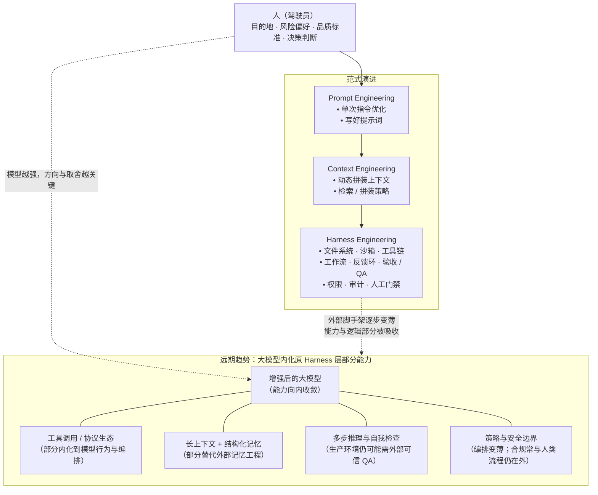

# 人工智能 Harness 时代：文章总结与示意图

> 原文：[汤道生：人工智能正式进入 Harness 时代 ] 

---

## 一、文章要点总结

### 1. 行业叙事转向

从追求**模型参数规模和理解能力（模型能力）**，转向了如何**约束、引导和应用模型以产生实际生产力（模型驾驭）**。

以 OpenClaw/HermesAgent/Cursor/ClaudeCode等为例：用**文件系统、代码沙箱、工具链、反馈与验收**等，把同一模型放进可**持续工作**的环境里。文中把这种围绕模型的「工作环境 / 外壳」概括为 **Harness（驾驭系统）**，喻为「马具、缰绳」。

### 2. 三元框架：发动机—线束—驾驶员

| 角色 | 比喻 | 含义（对应文中表述） |
|------|------|----------------------|
| 大模型 | 发动机 | 提供原始能力，但不会「自己上路」 |
| Harness | 线束与整车机制 | 将能力接通到工具、约束、反馈、验收与安全 |
| 人 | 驾驶员 | 最终决定产出质量；**AI 越强，对人的判断与品味要求往往越高** |

### 3. 为何 Harness 在叙事中站到台前（智能体范式）

智能体从「一次性回答」走向「持续执行任务」。工作天然需要工具、上下文延续、验收与纠错——这些整体可归入 **Harness**。文中提及 **Skills** 作为模型可读的能力描述单元，以及 **SkillHub** 等能力沉淀与跨框架共享的方向。

### 4. 四个工程侧观察

1. **能力天花板往往在模型之外**：同一模型更换 Harness，任务成功率等指标可显著提升（文中引 Nate Jones、LangChain 等案例）。
2. **约束是对智能的引导**：边界清晰时，Agent 可减少在无效路径上浪费 token（文中引 Cursor 大规模实验）。
3. **Harness 与安全**：权限、沙箱、审计与人工审批等，是企业环境敢用 AI 的前提。
4. **模型难以单独承担可靠 QA**：需在 Harness 侧建立**独立评估与质量闭环**，不能仅靠模型自评。

### 5. 工程范式的三代演进（递进包含，而非简单否定）

| 阶段 | 关键词 | 文中比喻 |
|------|--------|----------|
| 约 2022–2025 | Prompt Engineering | 给驾驶员地图 |
| 约 2025 | Context Engineering | 导航系统 |
| 约 2026 | Harness Engineering | 完整的车：仪表、反馈、安全约束与工作流 |

### 6. 终局猜想：脚手架变薄、Harness 被模型部分内化

随着上下文窗口、记忆与推理链、工具调用等能力提升，今日在外部搭建的**部分**工具链与编排可能逐步被模型吸收，Harness **变薄**；但若走向严肃生产与合规，**评估证据、风险控制与人类目标**在现实中仍常保留外层系统。文中强调：**「去哪里、为什么值得」始终是人的责任**。

### 7. 结语意象

大模型像是力量惊人的野马；**Harness 是缰绳与驾驭机制**。稀缺能力不只在于模型参数，还在于**可用的工作环境**与**知道目的地的骑手**。

---

## 二、示意图：Prompt / Context / Harness 与内化趋势

以下为 **Mermaid** 图；在 VS Code（含 Mermaid 插件）、Obsidian、Typora、GitHub 等平台可渲染。

### 读图说明

- **左侧**：自上而下表示 **Prompt Engineering → Context Engineering → Harness Engineering** 的递进与包含关系。
- **右侧**：概括文中「模型长出手脚、外部 Harness 变薄甚至部分被吸收」的方向；并不等于「不再需要任何外部系统」，尤其评估与合规常与组织流程绑定。
- **人**：在全阶段参与设定目标与承担责任；内化程度越高，**「干什么、干成什么样算好」**越凸显人的作用。

---

*文档生成于项目内存档，便于引用与迭代。*
